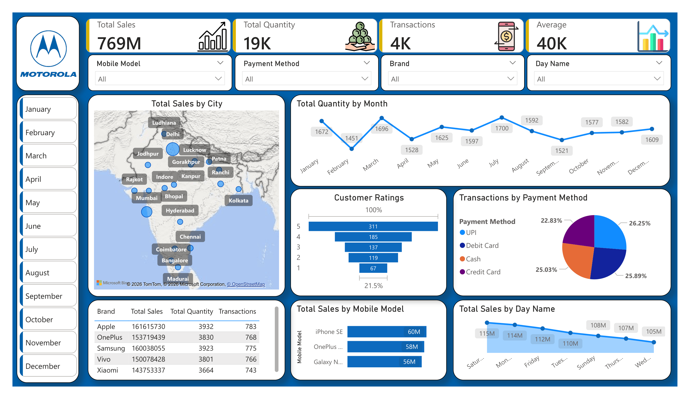

# Motorola Smartphone Sales Performance Dashboard



## Executive Summary
An interactive Power BI report analyzing nationwide retail transactions, product line performance, and customer purchasing patterns across key Indian metro markets. This project demonstrates end-to-end data visualization skills, ranging from data modeling and DAX metric creation to interactive dashboard design.

## Project Structure
- `Motorola_Sales_Dashboard.pbix`: The primary Power BI workbook containing the data model, relationships, and canvas layouts.
- `Dashboard_Preview.pdf`: An exported PDF allowing reviewers to inspect visual alignments directly within their browser.
- `Data/`: Folder containing the source data files.
- `Assets/`: Folder containing dashboard screenshots and custom image elements.

## Key Performance Indicators
- **Total Revenue:** 769M
- **Units Sold:** 19K units
- **Transactions Recorded:** 4K
- **Average Order Value:** 40K

## Data Model & DAX Calculations
The following custom DAX measures were developed to power the KPI cards and interactive visuals throughout the report:

**Average Price Per Unit**
```dax
Average = AVERAGE(Sales_Data[Price Per Unit])
```
**Total Units Sold**
```dax
Total Quantity = SUM(Sales_Data[Units Sold])
```
**Total Revenue Calculation**
```dax
Total Sales = SUMX(Sales_Data, Sales_Data[Units Sold] * Sales_Data[Price Per Unit])
```
**Total Number of Transactions**
```dax
Transactions = COUNTROWS(Sales_Data)
```

## Business Insights
Based on the interactive Power BI dashboard, the following key trends and analytical takeaways were identified:

*   **Revenue & Brand Leadership:** The dataset encompasses 769M in total sales across 4K transactions and 19K units sold. Samsung leads the competitive landscape with approximately 160M in revenue, followed closely by OnePlus (153M) and Apple (151M).
*   **Payment Method Parity:** Customer payment preferences are remarkably balanced. Debit Cards represent the most popular method (26.25%), marginally outpacing Credit Cards (25.89%), Cash (25.03%), and UPI (22.83%).
*   **Temporal Sales Trends:** Purchasing behavior fluctuates throughout the year, with August recording the highest monthly volume (1,700 units). On a weekly basis, transaction revenues peak prominently on Saturdays (115M) and Wednesdays (110M).
*   **Geographic Distribution:** Order volume maps heavily to major Indian metropolitan hubs, with prominent sales clusters in regions like Delhi, Mumbai, Lucknow, and Chennai. 
*   **Customer Satisfaction:** Post-purchase satisfaction is highly positive, with the majority of recorded reviews hitting the maximum 5-star rating (311 distinct ratings).
